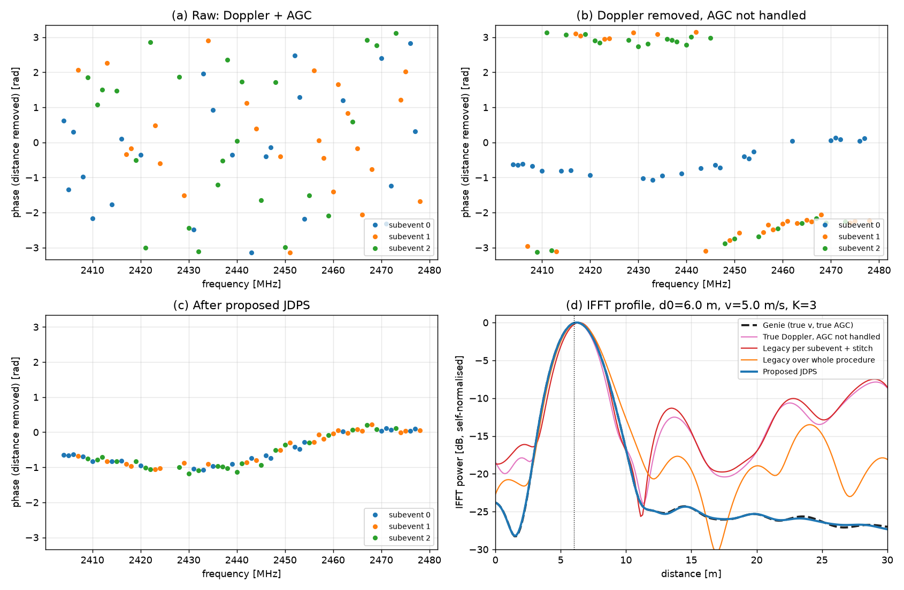
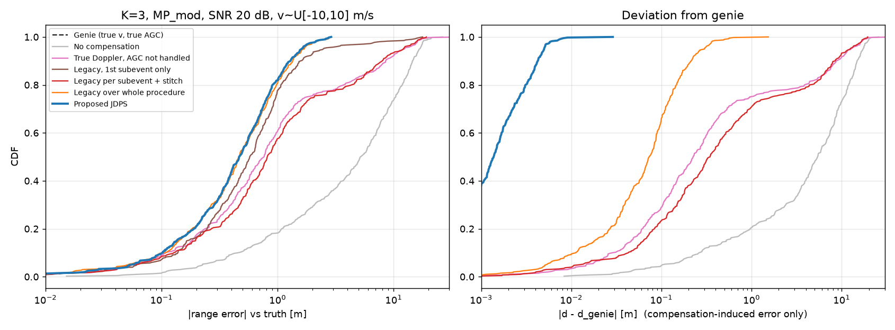
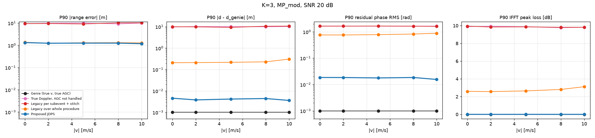
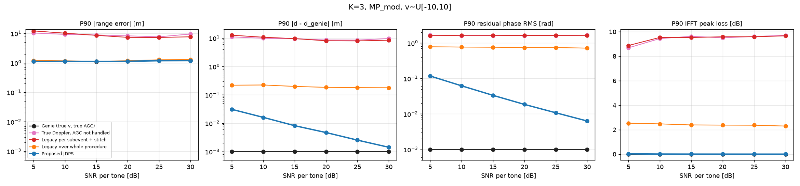
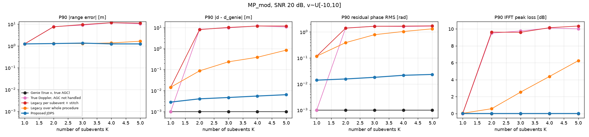

# BLE CS 多 subevent AGC 相位 + 多普勒联合补偿设计（JDPS）

> JDPS = **J**oint **D**oppler & **P**hase **S**titching（多普勒与相位联合拼接）
> 代码：`cs_agc/`；仿真结果：`results/`；复现：`pip install -r requirements.txt && python -m cs_agc.run_sim --trials 400 --out results`

---

## 0. 问题约束（已与需求方确认）

| 项目 | 设定 |
|---|---|
| 测量模式 | Mode‑2 PBR，initiator/reflector 两侧 IQ 相乘，往返相位，拼接后 **IFFT** 测距 |
| 信道 | 72 个 CS 信道（ch 2–22, 26–76，1 MHz 间隔），随机跳频，**各 subevent 信道不重叠** |
| subevent | 个数任意（常见 1–3），步数近似均分（如 25/25/22）；相邻 subevent 之间**空隙 40 ms**（上一个结束到下一个开始；24 step 的 subevent 约 17 ms，起点间距约 57 ms） |
| step 时序 | 测量 565 µs + 间隔 150 µs（step 周期 715 µs） |
| AGC | subevent 内不切档；**两侧**各引入一个未知的常数相位；无档位索引；只有常数相位（与频率无关） |
| 速度 | 支持 ±10 m/s（下限要求 ±5 m/s） |
| 天线 | 4 条 antenna path = 发起端 2 根 × 反射端 2 根（两根天线互相垂直）；path0=(0,0)、path1=(0,1)、path2=(1,0)、path3=(1,1)，括号内为（发起端天线, 反射端天线） |
| AGC 设定方式 | 按设备设定，每个 subevent 只设一次，与使用哪根天线无关 → 4 条路径共用同一组 AGC 相位（默认共享模式） |
| 算力 | 128 MHz MCU，4 路天线的 AGC/多普勒处理总时间 < 60 ms（不含测距本身） |

---

## 1. 问题现象



图 (a)–(c) 画的是去掉真实距离斜率之后的相位（LOS 场景，K=3，v=5 m/s）：

* **(a) 原始数据**：三个 subevent 的点完全杂乱。原因是随机跳频把多普勒产生的「时间斜坡」映射成了频率轴上的伪随机相位。
* **(b) 用真实 v 去掉多普勒后**：每个 subevent 内部变得平滑，但 subevent 之间有**整体台阶**，这就是 AGC 相位加上 subevent 间隔内累积的多普勒相位。
* **(c) 经过 JDPS**：三个 subevent 拼成一条连续曲线（剩下的缓慢起伏是多径造成的，属于真实信道）。

图 (d) 是 IFFT 距离谱。AGC 台阶不处理时，主瓣被部分抵消，旁瓣抬升 10–15 dB。

### 1.1 量化（K=3，MP_mod，SNR 20 dB，v~U[-10,10] m/s，400 次）

| 情形 | P90 测距误差 | 与 genie 偏差 >0.5 m 的比例 | IFFT 峰值损失 P90 |
|---|---|---|---|
| Genie（真实 v、真实 AGC） | 1.29 m | 0 % | 0 dB |
| 不做任何补偿 | 14.6 m | 86 % | 10.5 dB |
| **多普勒完美补偿、AGC 不处理** | **8.5 m** | **31.5 %** | **9.5 dB** |
| 现有算法按 subevent 单独做再拼接 | 8.0 m | 41 % | 9.8 dB |

结论：**即使多普勒补偿得完美，只要 AGC 台阶不处理，测距就会失效**。

### 1.2 机理

* **AGC 台阶**：随机跳频下，每个 subevent 都是覆盖全带宽的稀疏采样，自己的 IFFT 峰值也在真实时延处。拼接后得到 `P(τ)=Σ_k e^{jψ_k}·S_k(τ)`。当 ψ_k 之间相差接近 π 时，主瓣相消（K=2 时最严重），首径检测就会落到旁瓣或假峰上。
* **多普勒量级**：往返相位对距离的灵敏度为 4πf/c ≈ 102 rad/m。v=10 m/s 时：
  * 一个 24 step 的 subevent（约 17 ms）内相位变化约 17 rad；
  * 跨 40 ms 空隙相位变化约 41 rad（subevent 中心到中心约 57 ms，对应约 58 rad）；
  * 从第 1 个到第 3 个 subevent（中心间距约 114 ms），距离本身变化约 1.1 m（range migration，距离迁移）。

---

## 2. 信号模型与关键观察

对 antenna a、step n（属于 subevent k）、频率 f_n、时间 t_n，令 τ_n = t_n − t_ref（t_ref 为输出距离对应的参考时刻，取所有 step 的平均时间）：

```
y[a,n] = H_a(f_n) · exp(-j·4π·f_n·v·τ_n / c) · exp(j·ψ_k) + w
         ─────────   ────────────────────────────   ────────────
         t_ref 时刻    多普勒 + 距离迁移（精确形式，    AGC：θ_I,k + θ_R,k
         的往返信道    用各 step 自己的 f_n）
```

**观察 1：AGC 相位与「跨间隔多普勒」无法区分，也不需要区分。**
补偿后每个 subevent 剩下的是一个常数相位，等于 AGC 相位加上速度误差在间隔内累积的相位。我们只估计这个合并后的 ψ_k，因此 v 只需要从 subevent 内部的信息估计。

**观察 2：v 的误差会被 ψ_k 自动吸收。**
只要 v 的估计和补偿使用同一个 v̂、同一个绝对时间参考，δv 在间隔上造成的常数相位就会被 ψ̂_k 吸收。剩下的只有 subevent 内部的残余斜坡和迁移项，量级是 δv 乘以约 9 ms，非常小。所以对 v 的精度要求很宽松（仿真中 v 网格步长用 1 m/s 也几乎不掉性能）。

**观察 3：信道不重叠，但频率相邻。**
随机跳频下，相邻信道（Δf=1 MHz）大多来自**不同** subevent。取一对 n∈k、m∈j 且 ch_m = ch_n + o：

```
z = y'[m]·conj(y'[n]) ≈ |·|·exp( j·( c_o + ψ_j − ψ_k ) ),   c_o ≈ −4π·o·Δf·d/c（局部群时延项）
```

信道的频率连续性就是连接各 subevent 的「桥」，不需要重叠信道。K=3 时 70 个相邻对中约 2/3 是跨 subevent 的，信息量充足。

---

## 3. 对现有单 subevent 方案的评价

据描述，现有方案是：对 IQ 取相位，取相邻频点对，用 Δφ 对 Δt 做 NDFT 线性拟合得到速度参数，再反向补偿。

仿真确认：**在单 subevent（K=1）下它与 genie 几乎一致**（P90 1.25 m 对 1.24 m），思路本身是对的。扩展到多 subevent 时有以下问题：

| # | 问题 | 影响 | JDPS 中的改进 |
|---|---|---|---|
| 1 | 只取相位，丢了幅度 | 多径深衰落的频点相位基本是噪声，却和强频点等权 | 用复数乘积 `y_m·conj(y_n)`，天然按幅度加权 |
| 2 | ω 用固定的 f_c | f_n 在 ±1.5 % 范围内变化；v=10 m/s 时 subevent 边缘误差约 0.27 rad | 每一对用各自的 f_n、f_m，按 v 参数化 |
| 3 | 跨 subevent 的对（Δt 为几十 ms，默认约 57 ms，还叠加了 AGC 台阶）混入同一个拟合 | 全程一起拟合时，算法会**把 v 拉偏去「吸收」AGC 台阶**：v 误差 P90 0.78 m/s（JDPS 为 0.02）；残余相位 RMS 0.78 rad；峰值损失 2.5 dB（K=5 时 6.3 dB）；K 越大、间隔越长越差。按 subevent 单独做则完全不处理 AGC，直接失效（P90 8 m） | 按 (subevent_k, subevent_j, Δf) 分组：组内相干累加，组间非相干累加；AGC 由单独的相位同步步骤估计 |
| 4 | 补偿时只去掉时间斜坡 | 没有补偿距离迁移（±10 m/s、3 个 subevent 时约 1.1 m） | 补偿项用 `4π·f_n·v·τ_n/c`，同时去掉多普勒和迁移，输出 t_ref 时刻的距离 |
| 5 | 跨越 23–25 空洞的「相邻」对 | Δf 不是 1 MHz，截距被污染 | 只取 Δf 精确等于 o·1 MHz 的对 |

---

## 4. JDPS 具体方案

输入：`y[A][N]`（按跳频顺序）、`ch[N]`、`t[N]`、`se[N]`。输出：补偿后的 `y''[A][N]`，直接放到 1 MHz 网格上做 IFFT。

### Stage 0 — 构造频率相邻对（与天线无关，只算一次）
* 对 o ∈ {1, 2} MHz，找出所有 `ch_m = ch_n + o` 的对 (n, m)（72 个信道全用时约 138 对）。
* 分组号 `g = (o, se_n, se_m)`，共 2·K² 组。
* 预计算每一对的速度相位率：
  `α_i = 4π(f_m·τ_m − f_n·τ_n)/c − 4π·f_c·(τ̄_{se_m} − τ̄_{se_n})/c`。
  第二项是组内公共项，去掉后 |Z| 不变，但数值变小，适合 float32。

### Stage 1 — 速度搜索
```
z[a][i] = y[a][m_i] · conj(y[a][n_i])
M(v)    = Σ_a Σ_g | Σ_{i∈g} z[a][i] · exp(j·α_i·v) |        v ∈ [-11, 11]（±10 m/s 加 1 m/s 保护带），步长 0.25（89 点）
v̂      = argmax M(v) + 抛物线插值
```
* 相量用递推生成：`e^{jα_i(v+Δv)} = e^{jα_i v}·e^{jα_iΔv}`，内循环没有三角函数，每 16 步做一次重新归一化。
* 同一个相量供 4 路天线共用。

### Stage 1b — 速度可信度判断
速度搜索结果不一定可信：远端 IQ 缺失、ts 配不上时，输入全为 0；信号很弱时，速度谱只剩噪声。这两种情况下峰值会随机落在某个点上，常见的是落在网格边界（全 0 时固定落在 −v_max）。因此先算一个与 subevent 个数无关的分数：
```
S_g   = Σ_{i∈g} |z_i|²                      （每个天线、每组）
μ     = Σ_a Σ_g sqrt(π/4 · S_g)             纯噪声时速度谱的期望（Rayleigh 均值）
σ²    = Σ_a Σ_g (1 − π/4) · S_g             纯噪声时的方差
score = (max_v M(v) − μ) / σ
```
* 纯噪声时，K=1~5 下 score 最大约 4.5；有信号时，SNR 5 dB 下 K=1~5 的 1% 分位都 ≥ 5.9。样例实测 log 的 score 为 9.5。
* 判定规则：
  * 全为 0（σ=0）：返回 `no_signal`（C 版本 `subevent_motion_solve_speed` 返回 `ERRCODE_RANGING_ALG_NOT_ENOUGH_IQ`），IQ 原样返回。
  * score < 5 或峰值落在网格最外侧点：速度判为不可信，**按 v=0 补偿**，AGC 相位对齐照常进行。
  * 否则使用估计出的 v̂。
* 搜索范围在 ±v_max 外各加 1 m/s 保护带，所以真实 |v| 接近 10 m/s 时不会被误判为落在边界。

### Stage 2 — 多普勒与距离迁移补偿
`y'[a][n] = y[a][n] · exp(+j·4π·f_n·v̂·τ_n/c)`
MCU 上建议用 Q32 的「周数」相位累加器，`2·f_n·v̂·τ_n/c` 自然回卷，避免 float32 丢失大相位的精度。

### Stage 3 — AGC 相位同步
1. 用 y' 重新计算 z'，按组求和得到 `Z[a][o][k][j]`，模型为 `|·|·e^{j(c_{a,o}+ψ_j−ψ_k)}`。
2. 截距初值：`c_{a,o} = arg Σ_k Z[a][o][k][k]`（只用 subevent 内部的对，与 ψ 无关）。
3. 构造 K×K 厄米矩阵：`Q_kj = Σ_{a,o} Z·e^{-jc}`，`Hm = Q + Q^H`，满足 `Hm_kj ≈ e^{j(ψ_j−ψ_k)}`。
4. 对角线加移位 `max_k Σ_j|Hm_kj|`。**必须加**：K=2 时零对角矩阵的特征值是 ±λ，幂迭代会振荡。
5. 幂迭代 8 次得到 `x ≈ e^{-jψ}`，取 `ψ = −arg x`，并归一化使 ψ_0 = 0。
6. 用新的 ψ 更新 c，外层重复 3 次。

幂迭代求主特征向量相当于全局的相位同步，比逐个 subevent 串行估计更稳健，K×K（K ≤ 5）的运算量可以忽略。

### Stage 4 — 去除 AGC 相位
`y''[a][n] = y'[a][n] · exp(−j·ψ_{se_n})`，然后送入 IFFT 测距。

### 选项与兼容性
* **K=1 时 JDPS 自动退化为改进版的单 subevent 多普勒算法**，可以直接替换现有实现。
* 如果 AGC 相位在不同 antenna path 之间不同，用 `per_ant_theta=True`，每路天线单独做相位同步（仿真验证见 §6.4）。
* 可调参数：v 网格步长（0.25/0.5/1.0）、邻接阶数 orders（{1} 或 {1,2}）。

---

## 5. 仿真设置

| 项目 | 设定 |
|---|---|
| 信道 | 72 个信道随机排列，`np.array_split` 均分到 K 个 subevent（K=3 时 24/24/24） |
| 时序 | step 周期 715 µs，时间戳取测量段中心；subevent 之间空隙 40 ms（另测 100 ms），起点 = 上一 subevent 结束 + 空隙 |
| 多径 | 1 条 LOS + N 条 NLOS；额外路径长度服从指数分布；NLOS 功率 ∝ exp(−excess/6 m)，并按 Rician K 因子缩放；各天线路径相位独立 |
| 场景 | **LOS**：2 条 NLOS，K=10 dB<br>**MP_mod**：4 条 NLOS，K=3 dB（默认）<br>**MP_severe**：6 条 NLOS，K=0 dB<br>另加：各路径径向速度 v·cos β 不同 |
| PBR | `(h·e^{jθ_I}+n_I)·(h·e^{jθ_R}+n_R)`，θ_I、θ_R 每个 subevent 独立均匀分布；默认 4 路天线共享同一 AGC 相位 |
| 距离 / 速度 | d ~ U[1, 20] m；v ~ U[−10, 10] m/s（速度扫描时固定 \|v\|） |
| SNR | 单向单音 SNR，默认 20 dB，扫描 5–30 dB |
| 测距 | 79 点网格 + Hann 窗，1024 点 IFFT，4 路天线功率相加，首径检测（最大峰 −6 dB 门限的最早峰）+ 抛物线插值 |
| 指标 | 测距误差（相对真值）；**与 genie 的偏差**（只反映补偿本身引入的误差，排除多径偏差）；残余相位 RMS；IFFT 峰值损失；v 误差 |
| 次数 | 每个点 400 次 Monte Carlo，随机种子固定，可复现 |

对比方法：Genie；不补偿；真实多普勒但不处理 AGC；现有算法只用第 1 个 subevent；现有算法按 subevent 单独做再拼接；现有算法对全程一起做；**JDPS**。

---

## 6. 仿真结果

完整表格见 [`results/summary.md`](../results/summary.md)。

### 6.1 基线（K=3，MP_mod，SNR 20 dB，v~U[-10,10]）



| 方法 | P50 / P90 误差 [m] | 与 genie 偏差 P90 [m] | 残余相位 RMS P90 | 峰值损失 P90 | v 误差 P90 |
|---|---|---|---|---|---|
| Genie | 0.47 / 1.29 | 0 | 0 | 0 dB | 0 |
| 现有算法按 subevent + 拼接 | 0.82 / 7.97 | 8.46 | 1.66 rad | 9.8 dB | – |
| 现有算法对全程一起做 | 0.47 / 1.35 | 0.22 | 0.78 rad | 2.5 dB | 0.78 m/s |
| 现有算法只用 1 个 subevent | 0.58 / 1.58 | 0.55 | – | – | 0.14 m/s |
| **JDPS** | **0.47 / 1.29** | **0.004** | **0.02 rad** | **0.0 dB** | **0.02 m/s** |

JDPS 与 genie 几乎重合：补偿引入的距离偏差 P90 只有毫米级。

### 6.2 速度 / SNR / subevent 个数扫描





* **速度 0–10 m/s**：JDPS 在所有速度下与 genie 的偏差都 ≤ 0.01 m，对速度不敏感。
* **SNR 5 dB**：JDPS 与 genie 偏差 P90 为 0.03 m，而现有算法按 subevent 拼接时为 12.2 m。
* **K 从 1 到 5**：现有算法全程一起做时，偏差从 0.09 m（K=2）增长到 0.84 m（K=5），峰值损失增长到 6.3 dB；JDPS 始终 ≤ 0.01 m、0 dB。

### 6.3 场景鲁棒性（K=3，SNR 20 dB）：P90 误差 / 与 genie 偏差 P90 / v 误差 P90

| 场景 | Genie | 现有算法全程 | JDPS |
|---|---|---|---|
| LOS | 0.37 / 0 / 0 | 0.43 / 0.20 / 0.72 | **0.37 / 0.00 / 0.02** |
| MP_mod | 1.28 / 0 / 0 | 1.28 / 0.21 / 0.75 | **1.28 / 0.00 / 0.03** |
| MP_severe | 1.53 / 0 / 0 | 1.57 / 0.24 / 0.74 | **1.53 / 0.00 / 0.03** |
| subevent 空隙 100 ms | 1.18 / 0 / 0 | 1.48 / 0.77 / 1.03 | **1.18 / 0.00 / 0.02** |
| 各天线 AGC 相位不同 | 1.16 / 0 / 0 | 1.23 / 0.46 / 0.61 | 共享模式 1.18 / 0.27；**逐天线模式 1.16 / 0.00** |
| 各路径径向速度不同 | 0.51 / 0 / 0 | 1.24 / 1.20 / 3.03 | 1.15 / 1.06 / 4.27（见 §8） |

### 6.4 复杂度参数（K=3，SNR 10 dB；耗时为 C 模块 `subevent_motion_alg` 在 128 MHz 下的估算）

| 配置 | P90 误差 | 与 genie 偏差 P90 | v 误差 P90 | 估计耗时（4 条路径） |
|---|---|---|---|---|
| 步长 0.25，间隔 {1}（`PAIR_ORDER=1`） | 1.20 | 0.02 | 0.09 | 18.6 ms |
| 步长 0.5，间隔 {1} | 1.19 | 0.02 | 0.09 | 9.7 ms |
| 步长 0.25，间隔 {1,2}（C 模块默认，`PAIR_ORDER=2`） | 1.19 | 0.01 | 0.08 | 36.4 ms |
| 步长 0.5，间隔 {1,2} | 1.19 | 0.01 | 0.08 | 18.9 ms |
| 步长 1.0，间隔 {1,2} | 1.20 | 0.01 | 0.09 | 10.1 ms |

---|---|---|---|---|
| 步长 0.25，orders {1,2}（默认） | 1.19 | 0.01 | 0.08 | 8.56 ms |
| 步长 0.5，orders {1,2} | 1.19 | 0.01 | 0.08 | 5.03 ms |
| 步长 1.0，orders {1,2} | 1.20 | 0.01 | 0.09 | 3.26 ms |
| 步长 0.5，orders {1} | 1.19 | 0.02 | 0.09 | 2.64 ms |

---

## 7. MCU 实现：`c/subevent_motion_alg.c`（128 MHz，4 条天线路径）

### 7.1 与工程对齐的接口
C 模块按工程现有的 `motion_correct_alg` 风格编写：输入为 `channel_select_t`（跳频表、每个 subevent 的信道数、每个信道的测量时长、subevent 间隔），IQ 按信道号排列（`complex iq[ALG_CHANNEL_NUM]`，未测量的信道不参与计算），返回 `errcode_t`。时间约定与 `motion_effect_analyze` 完全相同（`ch_hop_orders[0]` 为 mode0，不参与计算）。

任何时刻内存里只需放一路 IQ，每路 IQ 按顺序提供 3 遍：

| 步骤 | 调用 | 做什么 |
|---|---|---|
| 初始化 | `subevent_motion_init` | 由 `channel_select_t` 建立每个信道的测量时刻和所属 subevent |
| 第 1 遍 | 每路 `subevent_motion_add_speed_path` → `subevent_motion_solve_speed` | 累加速度谱 → 估计速度并判断是否可信 |
| 第 2 遍 | 每路 `subevent_motion_add_phase_path` → `subevent_motion_solve_phase` | 在线补偿多普勒后累加分组和 → 估计各 subevent 相位（所有路径共用） |
| 第 3 遍 | 每路 `subevent_motion_iq_compensation` | 就地补偿这一路的 IQ，之后做这一路的 IFFT |

为了降低内存，实现上做了三点取舍：
* IQ 按信道号排列，信道对 (f, f+o) 直接由下标得到，**不需要配对表**；
* 速度搜索中每个速度点都直接计算 sin/cos（与原 `ndtft` 相同），**不保存旋转因子**；信道对的共轭乘积和相位率也在用到时现算；
* 第 1 遍的速度谱和第 2 遍的分组和放在同一个 union 里共用。

### 7.2 内存
上下文 `SubeventMotionCtx` 按算法阶段拆成：信道表 `SubeventChannelTable`（每个信道的测量时刻和所属 subevent）、结果 `SubeventMotionResult`、第 1 遍工作区 `SpeedSearchWork`（速度谱、组累加器、噪声统计）和第 2 遍工作区 `PhaseEstimateWork`（每条路径的分组和）；两个工作区放在同一个 union 里。

| 实现 | 常驻 / 堆 | 栈峰值 | 合计 |
|---|---|---|---|
| 原 `motion_correct_alg`（单路、不处理 AGC） | `MotionEffectInput` 堆 636 B + `MotionEffectResult` 92 B | 约 400 B | **约 1.1 KB** |
| `subevent_motion_alg`，`PAIR_ORDER=2`（默认）、最多 4 个 subevent | `SubeventMotionCtx` 1,516 B | 448 B | **约 2.0 KB** |
| 同上，最多 3 个 subevent（`-DSUBEVENT_MOTION_MAX_SUBEVENT_NUM=3`） | 1,052 B | ≤ 448 B | **约 1.5 KB** |
| `PAIR_ORDER=1`、最多 4 个 subevent | 1,004 B | 368 B | 约 1.4 KB |

（`ALG_CHANNEL_NUM` = 80、最多 4 条路径；栈为 x86 上 `-fstack-usage` 实测值，ARM 上通常更小；不含调用方的单路 IQ 缓冲 80 × 8 = 640 B。）

### 7.3 复杂度
周期假设（Cortex‑M4F/M33 float32，含 load/store，偏保守）：sincos 60 cycles、复数乘 8 cycles、复数取模 20 cycles。

| K | `PAIR_ORDER=2`（默认，约 138 对） | `PAIR_ORDER=1`（约 70 对） |
|---|---|---|
| 1 | 35.5 ms | 18.1 ms |
| 2 | 35.9 ms | 18.3 ms |
| 3 | **18.6 ms** | 36.4 ms |
| 4 | 37.2 ms | 19.0 ms |

* 约 95 % 的耗时在第 1 遍的速度搜索：每条路径、每个速度点、每个信道对做一次 sin/cos 和两次复数乘。原 `ndtft` 每条路径的计算量与此相当（101 个速度点 × 约 78 个点对 × cosf + sinf）。
* 如果需要进一步压缩，速度步长改为 0.5 m/s（默认配置下约 18.9 ms）（`MOTION_SPEED_RESOLUTION`，同时把 `SUBEVENT_MOTION_SPEED_POINT_NUM` 改为 45），耗时约减半，性能基本不变（§6.4）。
* 以上是估算值，需要在目标芯片上实测确认。

### 7.4 `PAIR_ORDER` 的选择
* `PAIR_ORDER=2`（默认）：同时使用间隔 1、2 的信道对，可信度分数约为只用相邻信道时的 1.5 倍（样例实测 log 为 9.5，门限 5），估计更稳；耗时约 36 ms。
* `PAIR_ORDER=1`：只用相邻信道，与原 `motion_correct_alg` 一致，内存约 -0.5 KB、耗时约减半；代价是可信度分数偏低（样例 log 为 5.8），仿真中 K=3、SNR 0 dB 时大部分正确的速度估计会因分数不足回退到 v=0。
* 速度超出 ±10 m/s 的支持范围时（例如 15 m/s），`PAIR_ORDER=2` 在仿真中出现过一次以略高于门限的分数接受了错误速度，`PAIR_ORDER=1` 则正确拒绝。

---

## 8. 局限与后续

1. **各路径径向速度不同**（设备移动、反射体静止时，这是更真实的模型）：JDPS 估计的是能量加权的「主导速度」，v 误差 P90 为 4.3 m/s。测距略优于现有算法（P90 1.15 m 对 1.24 m），但比「LOS 速度 genie」差约 0.6 m。
   改进方向：在距离‑速度二维上搜索首径速度（每个 v 候选做一次 128 点 FFT，约 252 次 FFT，粗估 15–25 ms，仍在预算内）。可以作为下一阶段工作。
2. **AGC 引入与频率相关的相位（群时延）**：目前按「只有常数相位」建模。如果存在群时延，会表现为每个 subevent 的距离偏差，需要按档位标定。后续如果有了档位索引，可以先查表粗补，再用 JDPS 估计残差。
3. **信道图有屏蔽信道**：相邻对会变少。orders 可以扩展到 {1,2,3}；分组数随 orders 线性增长。
4. **时间戳精度**：v=10 m/s 时，10 µs 的时间戳误差只对应约 0.01 rad，影响可以忽略。
5. **subevent 内 AGC 切档**：当前按「不切档」处理。如果以后会切档，把「subevent」换成「AGC 段」即可，算法结构不变。

## 9. 已确认的硬件条件与结论

* **AGC 按设备设定，每个 subevent 只设一次**：路径 (i, j) 的 AGC 相位为 α(k) + β(k)，与天线无关，因此 4 条路径共用一组 ψ_k，使用默认的共享模式（`per_ant_theta = False` / `per_ant_phase = 0`）。天线开关、走线等固定相位在各 subevent 之间不变，做相对相位时会抵消。
* **速度 4 条路径统一拟合**：两端设备之间只有一个相对运动速度。仿真对比显示统一拟合在所有场景下都不差于逐路拟合，在中低 SNR 和强多径下明显更好（SNR 5 dB 时与 genie 偏差 P90 为 0.03 m，逐路拟合为 0.11 m）。
* **两根天线互相垂直**：同极化与交叉极化路径的信噪比可能相差 10–20 dB。速度搜索和相位同步都用复数乘积按幅度加权，弱路径不会拖累估计。测距端目前是 4 路功率直接相加，以后可以考虑按各路直达径强度加权。
* 样例 log 中 path2、path3（发起端天线 1）在 SE1 的本地 IQ 幅度极低，这两路逐路估出的 ψ 偏差很大，原因是噪声而不是 AGC，也说明应该使用共享模式。
